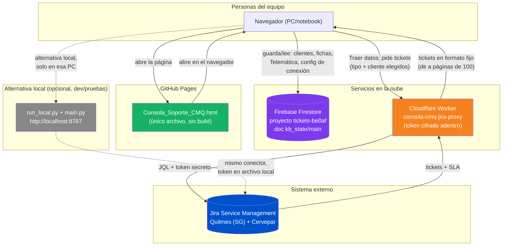

# Consola de Soporte CMQ — Documentación funcional y técnica

**Documento preparado como analista funcional.** Objetivo: que cualquier persona del equipo —de soporte o de sistemas— entienda qué es la Consola, cómo se usa día a día, y cómo está construida por dentro, sin depender de quien la desarrolló.

Fecha de este documento: 31/07/2026. Versión de la app cubierta: hasta v35 (ver `README.md` para el detalle versión por versión).

---

## 1. Qué es la Consola de Soporte CMQ

Es una aplicación web de una sola página (un archivo HTML, sin instalación) que centraliza el soporte de la mesa de ayuda para dos clientes principales — **Quilmes** y **Cervepar** — combinando:

- El historial real de tickets de **Jira Service Management**.
- Una base de **fichas técnicas** por cliente (equipos, referentes, configuración).
- Un registro manual de solicitudes para clientes **sin Jira** (módulo Telemática).
- Paneles de métricas y tiempos de respuesta/resolución sobre todo lo anterior.

Se puede abrir de dos formas, y ambas muestran los mismos datos compartidos:

| Forma de abrir | Link | Para qué sirve |
|---|---|---|
| **Publicada (recomendada)** | `https://dfcesetti-debug.github.io/consola.tickets/Consola_Soporte_CMQ.html` | Uso normal del equipo, desde cualquier PC, sin instalar nada. |
| **Archivo local** | Doble clic en `Consola_Soporte_CMQ.html` | Para quien esté desarrollando o probando cambios antes de publicarlos. |

---

## 2. Documento de uso — guía por pestaña

La barra lateral tiene 6 secciones:

### 2.1 Panel
Vista de arranque. Resume en KPIs y gráficos: cantidad de tickets, tiempos de respuesta/resolución (con SLA real de Jira cuando existe), quién respondió cada ticket, y una comparación entre clientes con SLA de Jira vs. clientes atendidos por Referente de Telemática. Tiene un filtro de rango de fechas propio para la sección de tiempos.

### 2.2 Matriz N1
Guía rápida de respuesta para el primer nivel de soporte: por cada tipo de ticket frecuente, qué preguntar y qué plantilla de respuesta usar. Se acota al cliente elegido arriba.

### 2.3 Tickets
Historial completo, buscable y filtrable (por tipo, estado, responsable — con selección múltiple). Acá vive también el bloque **"Traer tickets de Jira"**:
- Dos botones desplegables con tildes: **Tipo de ticket** (abiertos, en progreso, resueltos, etc.) y **Cliente** (solo lista los que tienen proyecto real en Jira: Quilmes y Cervepar). Sin marcar nada = trae todo.
- Botón **Traer datos**: dispara la consulta real contra Jira (vía el conector en la nube, sección 3.3) y reemplaza la base para que coincida exacto con Jira.
- **Configuración avanzada** (plegada): solo para cambiar la URL del conector si alguna vez hace falta apuntar a otro. No hace falta tocarla en el uso normal — ya viene guardada.
- También se puede cargar un export/respaldo manual (`.json`/`.doc`/`.html`) arrastrándolo.

### 2.4 Clientes
Alta, edición y color/prefijo de cada cliente. Acá se define si un cliente **viene por Jira** o **es de seguimiento del Referente de Telemática** (botón "Jira" / "Referente Telemática" en cada fila) — esto determina si aparece en el selector de clientes de Jira (2.3) y qué métricas de tiempo se le calculan (Panel, 2.1).

### 2.5 Ejecutivos
Dos vistas (botones arriba):
- **Fichas**: formulario técnico completo por cliente (estado, país, tipo de logística, referentes del cliente y de telemática, dispositivos GO, cámaras, reportes, reglas, zonas, reuniones recurrentes), con historial de cambios y exportación a PDF.
- **Cartera por ejecutivo**: listado de todos los clientes configurados (incluso los que todavía no tienen ficha cargada, con un cartel de "Pendiente"), filtrable por país, tipo de logística, ejecutivo comercial y referente de telemática.

### 2.6 Telemática
Para registrar manualmente el trabajo hecho con clientes que **no** tienen Jira (ver 2.4). Por cada solicitud se carga: cliente, tipo de solicitud (ver categorías abajo), fecha/hora de inicio y de fin, estado, responsable y detalle. Los tickets cargados se pueden reabrir en una ventana editable con historial de cambios.

**Categorías de "Tipo de solicitud"** (actualizado 31/07/2026):

| Categoría | Sub-tipos |
|---|---|
| Soporte | Carga de usuarios, Revisión de activo, Revisión de mediciones, Solicitud de video, Asignación de grupos a vehículos, Asignación de grupos a usuarios, Creación de reglas |
| Capacitaciones | Capacitación por área, Capacitación general, Capacitación de reportes, Capacitación de sala logística, Capacitación interna |
| Reportes | Reportes N°1, Reportes N°2, Reportes N°3 (ver definiciones formales en la ficha del cliente) |
| Desarrollo | Desarrollo |
| Coordinación | Coordinación |
| Laboratorio | Laboratorio |

Con esos datos, la Consola calcula: **Tiempo asignado** (reloj real entre inicio y fin) y **Tiempo estimado** (solo horas hábiles, lunes a viernes 8-17h dentro de ese rango), además de clasificar si la resolución cayó en horario laboral, fuera de jornada, o fin de semana.

---

## 3. Documento técnico — cómo está construida

### 3.1 Panorama general

La Consola es **un solo archivo HTML** con JavaScript "vanilla" (sin frameworks ni build step). No guarda nada por su cuenta de forma aislada: todo el estado que se comparte entre personas vive en una base de datos en la nube (Firebase), y los tickets de Jira se traen en vivo a través de un conector propio, también en la nube (Cloudflare Workers). Ver diagrama en la sección 4.

### 3.2 Almacenamiento compartido — Firebase (Firestore)

- Proyecto de Firebase: `tickets-be0af`.
- Toda la información editable de la Consola (clientes, reasignaciones, fichas de ejecutivos, tickets de Telemática, y la configuración de conexión a Jira) se guarda en **un único documento**: colección `kb_state`, documento `main`.
- Funciones clave en el HTML: `pushState()` (guarda) y `pullState()` (lee al arrancar la página).
- **Seguridad actual**: las reglas de Firestore están abiertas (`allow read, write: if true`) para simplificar el arranque del proyecto. Esto significa que cualquiera con el link público podría, en teoría, leer o modificar estos datos desde la consola del navegador. **Mejora pendiente**: sumar Firebase Authentication y restringir las reglas a usuarios autenticados antes de una difusión más amplia del link.
- La configuración de Firebase (`apiKey`, `projectId`, etc.) que aparece en el código **no es secreta** — es normal que sea pública en cualquier app web con Firebase. Lo que protege los datos son las reglas de seguridad, no esa configuración.

### 3.3 Conector de Jira — Cloudflare Workers (el token nunca sale de la nube)

Este es el punto más sensible del diseño: la Consola necesita autenticarse contra Jira con un token de API, pero ese token **no puede** viajar al navegador de cada persona ni quedar en el código público de GitHub.

Solución: un pequeño servidor (`worker/src/index.js`, JavaScript) desplegado en **Cloudflare Workers**, que:
1. Recibe la consulta desde la Consola (qué tipo de tickets, de qué cliente).
2. Arma la consulta JQL correspondiente y llama a la API de Jira usando el token, que vive como **secreto cifrado de Cloudflare** (`wrangler secret put JIRA_API_TOKEN`) — nunca en un archivo, nunca en git.
3. Devuelve los tickets en un formato fijo (ver contrato de datos, 3.5) que el HTML sabe interpretar.
4. Desde v35, responde **de a páginas de 100 tickets** (parámetro `paged=1`) en vez de la cadena completa de una sola vez — así ninguna consulta individual corre riesgo de cortarse por conexiones lentas.

URL pública de este conector: `https://consola-cmq-jira-proxy.df-cesetti.workers.dev`. Es la que queda guardada automáticamente (vía Firebase, sección 3.2) en el campo de conexión de la pestaña Tickets.

**Camino alternativo (local, para desarrollo/pruebas)**: `run_local.py` + `main.py`, un servidor Flask que corre en la PC de quien lo use, exponiendo el mismo conector en `http://localhost:8787`. El token vive en `tablero/token_local.json` (no se sube a git). Este camino sigue funcionando, pero **ya no es necesario** para el uso compartido — Chrome bloquea que una página pública (`https://`) le hable a `localhost` por política de seguridad (Private Network Access), así que solo sirve para quien lo corre en su propia PC.

### 3.4 Hosting — GitHub Pages

- Repositorio: `github.com/dfcesetti-debug/consola.tickets` (público, rama `main`).
- Se sube únicamente: el HTML de la Consola, y de la carpeta `tablero/` solo `README.md`, `main.py` y `run_local.py` (con el token reemplazado por un placeholder). **Nunca** se sube `token_local.json` ni `kb_state.json` (datos viejos con información de contacto real) — ver `.gitignore` en la raíz del repo.
- GitHub Pages sirve el HTML directo desde el repo, sin build ni servidor propio.

### 3.5 Contrato de datos del conector de Jira

Tanto `main.py` (Python, uso local) como `worker/src/index.js` (JavaScript, uso en la nube) devuelven **exactamente el mismo formato**, para que el HTML no tenga que distinguir cuál lo atendió:

```
{
  "consulta": "...", "proyecto": "...", "jql": "...",
  "metricas": { "total_tickets": N, "por_tipo": {...} },
  "registros": [
    {
      "key", "resumen", "tipo", "estado", "prioridad",
      "asignado_a", "informador",
      "fecha_creacion", "fecha_resolucion", "fecha_actualizacion",
      "descripcion", "comentarios": [{"autor","fecha","texto"}],
      "sla": {
        "first_response":  {elapsed_ms, goal_ms, breached, ongoing} | null,
        "resolution":      {elapsed_ms, goal_ms, breached, ongoing} | null,
        "waiting_customer":{elapsed_ms, goal_ms, breached, ongoing, computed?} | null,
        "all": [...]
      }
    }
  ]
}
```

**Importante para quien mantenga esto a futuro**: si se cambia algún nombre de campo acá, hay que actualizarlo en los dos conectores (Python y JavaScript) **y** en la función `ticketTimes()`/`apiTicket()` del HTML, en el mismo cambio — si no, los tiempos y el detalle del ticket dejan de mostrarse correctamente.

---

## 4. Diagrama de flujo — cómo se conectan las piezas



**Lectura del diagrama**: el navegador de cada persona es el único punto donde se ve la aplicación; nunca ve el token de Jira. Lo que se comparte entre personas (fichas, clientes, Telemática, y qué URL de conexión usar) pasa por Firebase. Lo que requiere autenticarse contra Jira pasa siempre por el Worker de Cloudflare, que es el único lugar donde vive el token. La alternativa local (`run_local.py`) es un camino aparte, solo útil en la propia PC de quien la corre.

---

## 5. Referencia rápida

| Elemento | Valor |
|---|---|
| App publicada | `https://dfcesetti-debug.github.io/consola.tickets/Consola_Soporte_CMQ.html` |
| Repositorio | `https://github.com/dfcesetti-debug/consola.tickets` |
| Conector de Jira (nube) | `https://consola-cmq-jira-proxy.df-cesetti.workers.dev` |
| Proyecto Firebase | `tickets-be0af` (Firestore, doc `kb_state/main`) |
| Historial detallado de cambios | `tablero/README.md` (versionado v1 a v35) |

---

*Este documento describe el estado de la plataforma al 31/07/2026. Para cambios posteriores, consultar el Registro de cambios en `README.md`, que se actualiza con cada versión nueva.*
